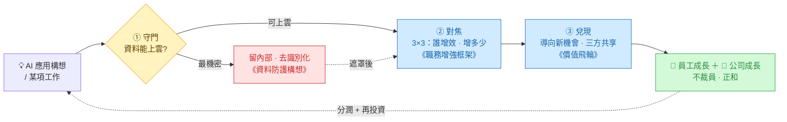

# AI 導入總覽 —— 終點是「員工成長 ＋ 公司成長」

> 公司的起點是個三難:**雲端 AI 能力強但怕外洩、自建太貴、便宜的又明顯難用。**
> 這套文件給的解法是 —— **選雲端的能力,但用三道關卡把風險擋下、把增效對焦、把成果分享,
> 讓終點落在「員工成長 ＋ 公司成長」,而不是用機器換掉人。**
>
> 本頁是入口與地圖;細節在下面三份文件。

---

## 一、一條主線:任何 AI 導入都要過三關

| 關卡 | 要回答的問題 | 對應文件 |
|------|--------------|----------|
| ① **守門** | 這份資料 / 工作**能不能上雲**? | 雲端AI資料防護構想 |
| ② **對焦** | 哪些職務**增效、增多少**?先導入誰? | AI職務增強評估框架（3×3） |
| ③ **兌現** | 增效**怎麼變成長、怎麼分**? | AI增效價值飛輪與分配 |

三份文件正好就是這三關。本總覽把它們接成**一條決策流**,終點是員工與公司**一起**成長。

---

## 二、決策流主圖（三面一體）

> 最後一條虛線(成果繞回 → 帶動下一個 AI 構想)讓整張圖本身就是個**飛輪**:
> 每轉一圈,員工與公司一起再長一點。

---

## 三、三份文件導覽

| 文件 | 回答什麼 | 一句話結論 | 核心圖 |
|------|----------|------------|--------|
| ① [雲端AI資料防護構想](雲端AI資料防護構想.md) | 資料能不能上雲、怎麼用又不外洩 | **資料分級 + 工具界接 + 廠商承諾** 三層縱深防禦,最機密的從源頭擋下 | 防護閘道 / 三層防禦 |
| ② [AI職務增強評估框架](AI職務增強評估框架.md) | 誰增效、增多少、先導入誰 | **產出物 × 工具關係** 兩把同源的尺交叉成 3×3;**文件 × 製作 = 甜蜜點** | 雙階梯圖 / 3×3 矩陣 |
| ③ [AI增效價值飛輪與分配](AI增效價值飛輪與分配.md) | 增效怎麼變成長、怎麼分、會不會裁員 | 增效**導向新機會**(不砍人);**個人 / 公司 / 再投資**三方共享,飛輪才轉 | 價值飛輪 / 分配交換表 |

> **附・落地**:[Claude落地實作示例](Claude落地實作示例.md) —— ① 的實作版,以 Claude 為例把閘道對應到真實機制(tool use / MCP / ZDR / 資料駐留),並附閘道骨架虛擬碼。
>
> **附・資料面**:[資料數位化程度與AI介入](資料數位化程度與AI介入.md) —— 你的資料數位化到哪一級、AI 在每一級能做什麼(數位化 → OCR → 正規化 → 串接 → 直接接入 AI)。

---

## 四、把三份縫起來的兩個鉤子（總覽才看得到）

- **「制度化」是同一件事**:能力面(②)的「**制度・系統**」階,就是價值面(③)飛輪的第一個接點
  「個人 → 全體」。把個人技巧變成全體可複用的資產 —— 在兩份文件裡是**同一個動作**。
- **「資料分級」可當第三軸**:風險面(①)的資料分級,疊到能力面(②)的 3×3 上,
  就變成 **「該不該上雲 × 誰增效 × 用哪種 AI」** 的立體決策。

---

## 五、怎麼讀（依角色入口）

| 角色 | 最關心 | 建議入口 |
|------|--------|----------|
| 經營者 / 老闆 | 投得回來嗎?會外洩嗎? | ③ 價值飛輪 → ① 資料防護 |
| 部門主管 | 我的團隊誰先導入 | ② 職務框架（3×3） |
| 一般員工 | 我會不會被取代 | ③ 的「**不裁員是前提**」段 |
| 資安 / 法遵 | 資料風險與合規 | ① 資料防護 |

---

## 六、下一步:從論述到落地

這套文件完成的是**論述骨架**(為什麼這樣做)。接下來是落地(怎麼做):

1. **訂制度**:把飛輪三個接點變成規則 —— 方法怎麼擴散、誰負責「對準機會」、分潤怎麼算。
2. **做試算**:用實際數字把「成本 vs 效益」做成可填表(重點是**導流率**,不是省下的薪資)。
3. **備機會接口**:事先列好「原本觸及不到的機會」,讓釋放的產能一出現就有地方倒。
4. **公開承諾**:把「不裁員、增效用來開拓機會」講清楚 —— 這是員工敢交出效率的開關。

> **一句話收尾**:用雲端的能力、守住資料的底線、對焦真正受惠的職務、把成果分回給人 ——
> 讓 AI 的終點是**員工成長 ＋ 公司成長**。
