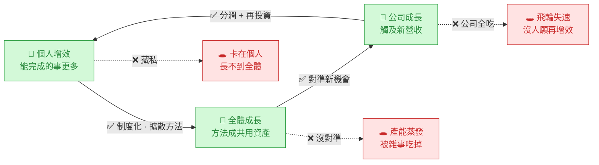

# AI 增效的價值流與分配

> 一句話:**增效＝一筆「被釋放的產能」。它只有兩個問題 ——
> ①往哪去(方向):選「成長」不選「砍人」;②價值怎麼分(分配):個人 / 公司 / 再投資三方都要拿到,飛輪才轉。**

---

## 一、先收斂:增效只有兩個問題

| 問題 | 選項 | 本文主張 |
|------|------|----------|
| **方向**：釋放的產能往哪去? | 砍人省成本 ↔ 拿去成長 | ✅ 成長（不裁員） |
| **分配**：創造的新價值怎麼分? | 公司全拿 ↔ 三方共享 | ✅ 三方共享 |

---

## 二、方向:同一筆增效,三種下場

| | 削減路線 | **成長路線（建議）** | 蒸發（最常見的漏接） |
|---|---|---|---|
| 產出 | 不變 | 變多 / 變新 | 不變 |
| 人力 | 減 | 不變 | 不變 |
| 價值來源 | 省成本 | 拓營收 | 無 |
| 天花板 | 現有規模 | 市場大小 | — |
| 員工感受 | 恐懼、抵抗 | 參與、成長 | 無感、鬆懈 |
| 本質 | 零和 | 正和（把餅做大） | 白忙一場 |

⚠️ **真正的敵人是「蒸發」,不是「裁員」**:增效後產能沒被導向任何地方,就被帕金森定律吃掉(事情自動膨脹填滿時間)——既沒省到、也沒長到。所以「**導向**」是關鍵動作,「導流率」是成敗指標。

**機會接口(把「原本觸及不到的機會」具體化,事先備好讓產能有地方倒):**
- **長尾變划算**:以前不敷成本的小客戶 / 小案子,現在做得起
- **深度**:同一客戶更多服務 / 接觸點 → 拉高客單價、續約
- **速度**:更快交付 → 接更多案、搶得到標
- **廣度**:進入以前做不起的新客群 / 新市場
- **新品**:有餘力做 R&D、實驗、開新產品線
- **回收**:把外包的、或當初砍掉的事拉回來自己做

---

## 三、價值飛輪圖

> 個人增效不會自動變成公司成長 —— 它是一個**飛輪**,每個接點接對了才往下傳,接錯了就從漏點漏掉。
> 而且果實必須**繞回個人**(分潤+再投資),飛輪才會持續加速。

| 接點 | 接對了要做什麼 | 漏掉會怎樣 |
|------|----------------|-----------|
| 個人 → 全體 | 把方法 / prompt **制度化、擴散**（即「制度」層） | 卡在個人藏私,長不到全體 |
| 全體 → 公司 | 把產能**對準新機會**（經營者指方向） | 產能閒置 / 蒸發 |
| 公司 →（回流）→ 個人 | 成長果實**分潤 + 再投資** | 飛輪失速,下一輪沒人願增效 |

---

## 四、三方分配（個人 / 公司 / 再投資）

> 原則只有一條:**只要有人完全分不到,飛輪就斷在那個接點**。
> 各分多少是經營者的決策 —— 本文不替你訂比例,只點出「三方都得拿到一些」這條底線。

**個人 ↔ 經營者,本質是一筆交換(雙方都要「得到 > 付出」):**

| | 付出（成本） | 得到（效益） |
|---|---|---|
| **個人** | 學新工具、改變習慣、**願意揭露方法** | 酬勞 / 獎金、能力資產、少做雜事、成長 |
| **經營者** | 工具投資、訓練、**分潤**、指出機會方向 | 釋放的產能、營收成長、競爭力 |

**失衡的後果:**
- 公司全吃 → 個人**藏私**,「個人→全體」斷。
- 個人全拿 → 公司不再投資,「公司→個人」斷。
- 不留**再投資** → 下一輪沒工具、沒新機會,飛輪停。

---

## 五、關鍵前提:「不裁員」是經濟前提,不是恩惠

> 若員工相信「我把自己變高效 → 公司就不需要我」,理性反應是**藏產能、慢慢做**(自保)——
> 於是你**根本拿不到那筆增效**。

「不裁員、增效用來開拓機會」這個**公開且可信的承諾**,正是讓員工**敢把效率交出來**的開關。
否則前一份框架(3×3)算出來的紅利,會被行為性地鎖死。

---

> **系列**:[總覽](00-AI導入總覽.md)｜① [資料防護](雲端AI資料防護構想.md)｜② [職務框架](AI職務增強評估框架.md)｜**③ 價值飛輪（本篇）**｜🔧 [Claude 落地](Claude落地實作示例.md)｜📊 [資料數位化](資料數位化程度與AI介入.md)
