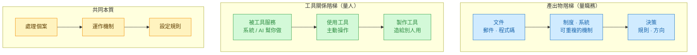
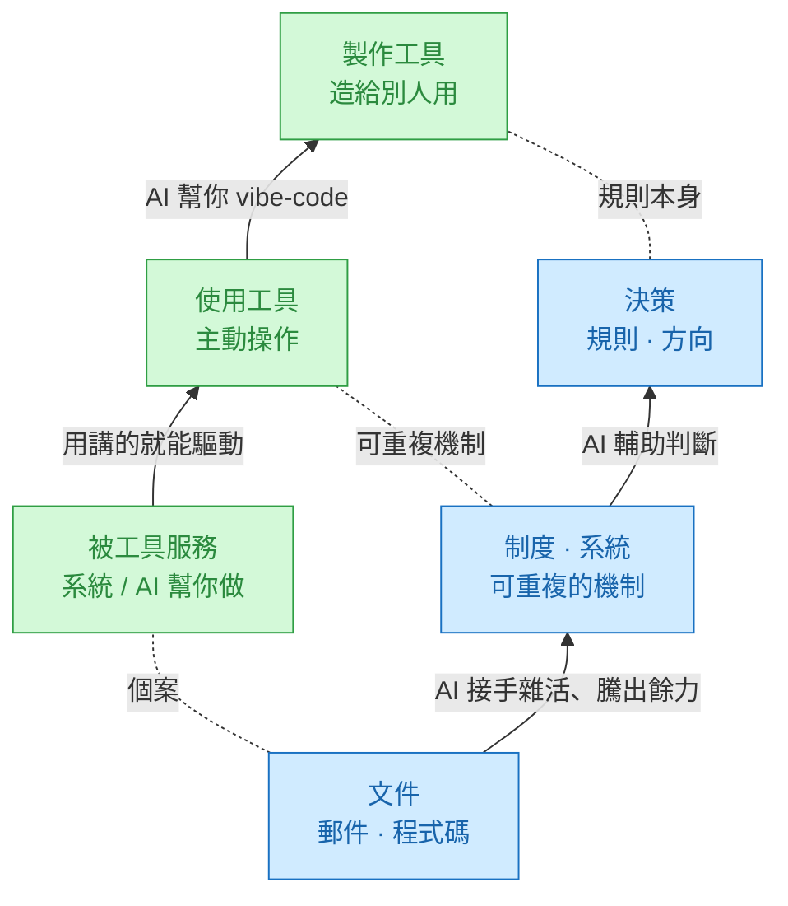

# AI 對職務的增強評估框架

> 一句話：**用「同一把槓桿尺」量兩個面 —— 工作成果(產出物)與工具關係(能力)——
> 交叉成 3×3,再依各層級 AI 工具的成熟度,評估每個職務被 AI 增強的幅度。**

---

## 一、兩個維度,其實是同一把尺

骨架都是同一條階梯:**個案 → 可重複機制 → 規則本身**(由低槓桿到高槓桿)。三組擺在一起(由左到右＝低 → 中 → 高),一眼看出是「同一把尺」:

- 產出物層級 → 偏**類別**,給職務定位(主要產出落在哪階)。
- 工具關係 → 偏**占比/光譜**,給人畫像(被服務 / 使用 / 製作各占多少)。
- 同一個人兩軸可站不同階(CEO＝決策×被服務;自動化工程師＝文件×製作)——
  所以是**矩陣,不是單線**。

---

## 二、雙階梯圖

> 藍＝產出物階梯(量職務)、綠＝工具關係階梯(量人);
> 中間虛線串起的「個案 / 可重複機制 / 規則本身」就是兩者**共用的槓桿尺**。
> 向上的箭頭＝**AI 推每個人往上爬一階**。

**怎麼讀**:AI 紅利不是「取代」,而是讓人從下階升到上階 ——
被服務的人開始會用、會用的人開始能造;做文件的人有餘力設計制度、設計制度的人有餘力做決策。

---

## 三、3×3 矩陣（落點與 AI 紅利）

> 兩張表同一個排法:每列(你做出什麼)由上到下＝**文件 → 制度 → 決策**;每欄(你跟工具的關係)由左到右＝**被服務 → 使用 → 製作**。
> 🔴🟡🟢＝該層級 AI 工具的成熟度;🔥⚡🌱＝該格現在的 AI 紅利。
> 紅利梯度:**左下(冷)→ 右上(熱)**;**右上＝文件 × 製作＝最佳起手區**。

**職務落點對照表**(可直接填你公司的職稱):

| 產出物 ↓ ＼ 工具關係 → | 被工具服務 | 使用工具 | 製作工具 |
|---|---|---|---|
| **文件**（🟢最成熟） | 行政/客服 · ⚡需訓練 | 文案/一般工程師 · 🔥高紅利 | 自動化工程師 · 🔥🔥甜蜜點 |
| **制度・系統**（🟡成熟中） | 流程承辦 · ⚡中 | 部門主管 · ⚡中 | 系統分析/RPA · 🔥高 |
| **決策**（🔴最不成熟） | 高階主管 · 🌱AI 當參謀 | 策略/分析師 · ⚡加速分析 | 決策建模者 · ⚡輔助為主 |

### 白話版（完全沒概念也看得懂）

別管上面的術語。其實只要回答**兩個問題**,就知道 AI 現在能幫你多少 ——

**問題一:你上班主要「做出」什麼?**
- 📄 **一件件具體的東西**:寫信、做報表、寫程式、畫圖(做完一件算一件)
- 🔁 **一套會重複跑的辦法**:設計一個流程、一套表單、一個系統,之後很多人照著用
- 🧭 **方向的決定**:要不要做、錢給誰、往哪走

**問題二:你跟電腦 / AI 是什麼關係?**
- 🤲 **等它幫你做好**:你收成果,不太需要自己操作
- ✋ **自己動手操作**軟體把事情做出來
- 🔧 **會自己弄工具、會調教 AI** 幫你做更多

把兩個答案一交叉,看你落在哪一格:

| 你做出↓ ＼ 你跟工具→ | 🤲 等它做好 | ✋ 自己操作 | 🔧 會弄工具 / 調教 AI |
|---|---|---|---|
| 📄 一件件東西 | 出納、資料 key-in ⚡ 學會用就很有感 | 平面設計、記帳會計 🔥 幫超多 | 會寫 Excel 巨集的人 🔥🔥 最有感,先導入 |
| 🔁 一套辦法 | 人資專員 ⚡ 有感 | 專案經理、店長 ⚡ 有感 | IT 工程師 / 導入顧問 🔥 幫很多 |
| 🧭 方向決定 | 老闆、董事長 🌱 AI 當參謀,人拍板 | 財務長、行銷總監 ⚡ AI 加速找答案 | 技術創辦人 ⚡ AI 輔助為主 |

**一句話看懂:**
- **越靠右上**(做一件件東西 ＋ 自己會弄工具)→ AI **現在幫最大**,這群人先用、效果最明顯。
- **越靠左下**(只負責拍板 ＋ 只等工具自動做好)→ AI **現在只能當助手 / 參謀**,最後還是人決定。
- 想多吃到 AI 紅利,動作就是**往右挪一步**:不會用的 → 學會用、會用的 → 學會調教 AI。

---

## 四、怎麼用：評估公式與導入順序

**評估公式**

> 某職務被 AI 增強的幅度 ≈ **該產出層級的 AI 成熟度 × 工作者的工具關係**
> (越靠「製作」端,放大越多)

**導入順序(由矩陣直接讀出)**

1. **先打 🔥 區**(文件 × 製作 / 使用、制度 × 製作):紅利大、易驗證、ROI 最明顯,拿來證明效益、說服老闆。
2. **再推 ⚡ 區的人往右爬**:對「被服務」者做訓練,讓他們從「被服務」→「使用」,把看得到吃不到的紅利兌現。
3. **決策層(🌱/⚡)以輔助為主**:AI 當參謀、加速分析,**最終判斷仍由人保留**(AI 在此最不成熟、風險最高)。

---

> 想再疊第三軸(資料敏感度 / 能否上雲端),接《[雲端AI資料防護構想](雲端AI資料防護構想.md)》的資料分級即可。
