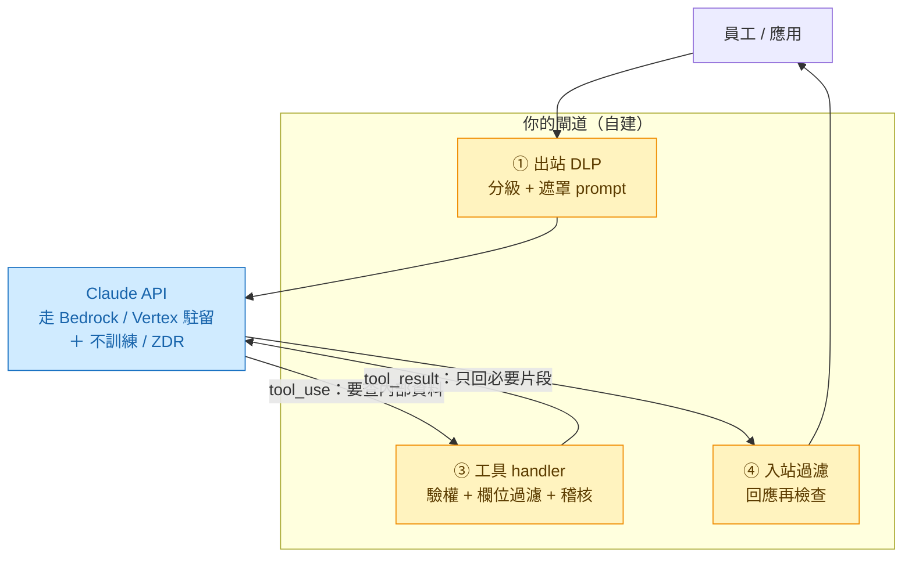
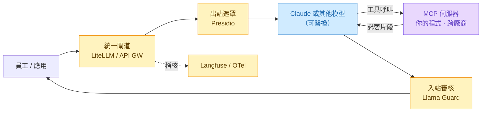

# 雲端 AI 資料防護 —— 以 Claude 為例的落地實作示例

> 這份把《[雲端AI資料防護構想](雲端AI資料防護構想.md)》那層「閘道」從**構想**落到**可實作**:
> 以 Anthropic Claude 為例,逐項對應到平台真實機制,並給出閘道骨架的虛擬碼。
> (程式為**示意**,模型 ID、用法依官方 SDK;商用條款數字以你簽的企業合約為準。)

---

## 一、先記住:閘道管「兩條流」,防法不同

| 流向 | 是什麼 | 誰把關 |
|------|--------|--------|
| **① 對話內容(出站 prompt)** | 你放進 `messages` / `system` 的字 | **你的程式**。API 只看得到你送的——分級 / 遮罩在呼叫前做掉 |
| **② 工具取資料(tool-mediated)** | 模型「想查」公司內部系統 | **架構天生保證**。模型只發 tool 請求,**你的 handler 決定回什麼**;模型從不直連你的 DB |

→ 機密資料**不必進對話**,讓模型透過工具來要,你只回必要片段。

---

## 二、三層防護 → Claude 真實機制對照

| 你的防線 | Claude / Anthropic 對應 |
|----------|------------------------|
| **工具界接** | **Tool use / MCP**:你定義工具、模型呼叫、**你的程式執行回傳**。用 manual agentic loop 可逐次攔截(核可、稽核、條件放行、human-in-the-loop) |
| **最機密不進對話** | **MCP Vault**:憑證/密鑰**永不進模型上下文**,出口才代換(注入也偷不走);一般機密欄位靠你閘道的遮罩 + RAG 片段化 |
| **信譽廠商承諾** | **不訓練**(商用 API 預設不拿你的資料訓練)＋ **ZDR**(Zero Data Retention,符資格企業)＋ **資料駐留**(Bedrock 留你 AWS 區域 / Vertex 留你 GCP 專案 / `inference_geo` 指定推論地) |

---

## 三、一個請求的流(閘道檢查點)



每個 `①③④` 都是你掌控、可稽核的點。

---

## 四、閘道骨架(虛擬碼,示意)

### 4.1 出站 DLP —— 流①(呼叫前在你的程式)

```python
def build_prompt(user_text, level):
    if level == "最機密":
        # 不進對話;改走工具取(見 4.2)。這裡只放指標/代號
        user_text = redact_secrets(user_text)      # 你的遮罩規則
    return user_text
```

### 4.2 工具界接 + 核可閘門 + 欄位過濾 —— 流②(manual agentic loop)

```python
tools = [{
    "name": "lookup_order",
    "description": "查訂單;只回必要欄位。需要時呼叫。",
    "input_schema": {"type": "object",
        "properties": {"order_id": {"type": "string"}},
        "required": ["order_id"]},
}]

messages = [{"role": "user", "content": build_prompt(q, level)}]
while True:
    resp = client.messages.create(
        model="claude-opus-4-8", max_tokens=16000,
        tools=tools, messages=messages)
    if resp.stop_reason == "end_turn":
        break
    messages.append({"role": "assistant", "content": resp.content})
    results = []
    for b in [x for x in resp.content if x.type == "tool_use"]:
        # ── 你的閘道就在這一段 ──
        audit_log(b.name, b.input)                 # 稽核
        if is_high_risk(b.name):
            require_human_approval(b)               # human-in-the-loop
        raw = call_internal_system(b.name, b.input) # 連你的 DB(模型碰不到)
        safe = mask_and_pick_fields(raw, level)     # 去識別化 + 只挑必要欄位
        results.append({"type": "tool_result",
                        "tool_use_id": b.id, "content": safe})
    messages.append({"role": "user", "content": results})

final = postprocess(resp)   # ④ 入站再過濾
```

> 關鍵:`call_internal_system` 是**你的程式**在你的網內執行,模型只拿到 `safe`(遮罩後片段)。

### 4.3 資料駐留 —— 換 client 即可(不改邏輯)

```python
# Amazon Bedrock(留在你的 AWS 區域 / 帳號)
from anthropic import AnthropicBedrockMantle
client = AnthropicBedrockMantle(aws_region="ap-northeast-1")
# 模型 ID 加前綴:"anthropic.claude-opus-4-8"

# Google Vertex AI(留在你的 GCP 專案 / 區域)
from anthropic import AnthropicVertex
client = AnthropicVertex(project_id="your-proj", region="asia-east1")
# 模型 ID 用裸 ID:"claude-opus-4-8"
```

### 4.4 廠商承諾 —— 帳號 / 合約層(非程式)

- **不訓練**:商用 API 預設;確認你的方案條款。
- **ZDR**:向 Anthropic 企業窗口申請(符資格企業),把保留期降到零。
- **稽核 / 區域**:Bedrock 用你 AWS 的 CloudTrail/IAM;Vertex 用 GCP 的 audit log。

---

## 五、不想全部手刻?接第三方工具(可選)

上面的 DLP、工具 handler、入站過濾都是**手刻 ＋ Claude SDK**。實務上每一塊都有現成的第三方工具可接,而且**閘道不必綁 Claude** —— 把閘道擺在「模型之前」,後面的模型就能替換。

| 閘道環節 | 手刻版(第四節) | 可換的第三方工具 |
|----------|----------------|------------------|
| **LLM 接口** | 直接呼叫 Anthropic SDK | **LiteLLM** / API Gateway(Kong、APISIX)當統一入口 —— 換模型不動業務碼,集中金鑰與計量 |
| **出站 DLP / 遮罩** | 自寫 `redact_secrets` | **Microsoft Presidio**(開源 PII 偵測+去識別化)、Nightfall、MS Purview |
| **工具界接** | 自寫 manual loop | **MCP 伺服器**(開放標準,跨廠商)、LangChain / LlamaIndex 的 tool / agent |
| **入站過濾 / 審核** | 自寫 `postprocess` | **Llama Guard**、NVIDIA NeMo Guardrails、商用內容審核 API |
| **稽核 / 可觀測** | 自寫 `audit_log` | **Langfuse**、OpenTelemetry、雲廠商 audit log |

把這些掛在一個**統一閘道**(例如 LiteLLM)上,後面接 Claude 或任何模型:



> **MCP 最值得用**:它是**開放標準**,工具寫一次(MCP 伺服器),Claude 和其他支援 MCP 的客戶端都能接 —— 「工具界接」這層天生就不綁單一廠商。
>
> **取捨**:第三方工具省下手刻,但多了**部署與供應商**(又一個要評估資料流向的對象)。最機密場景建議選**可自架**的(Presidio、MCP 伺服器、LiteLLM 都能架在你自己網內),別把機密再經過一個外部 SaaS。

---

## 六、你做 vs Anthropic 給

| 你自己做(閘道本體) | Anthropic 提供(平台側) |
|---|---|
| 資料分級、**PII/DLP 遮罩**(Anthropic 無內建 DLP) | Tool use / MCP 的「模型發請求、你執行」架構保證 |
| 工具定義與 handler、欄位過濾 | MCP Vault 憑證隔離(出口代換、注入偷不走) |
| 核可流程、稽核紀錄、入站再檢查 | 不訓練 / ZDR / Bedrock·Vertex 駐留 / 自管沙箱 |

---

## 七、注意與查證

1. **合約數字以你簽的為準**:不訓練、保留天數、ZDR 資格、駐留區域屬契約層,找 Anthropic 企業窗口確認。
2. **ZDR 有取捨**:零保留會關掉少數需留存的功能(如某些模型要求最低保留期、跨請求快取/路由優化)——安全 vs 功能要權衡。
3. **DLP 是你的責任**:平台不幫你判斷「哪句話含個資」,這層規則與維運是公司自己的。

---

> **系列**:[總覽](00-AI導入總覽.md)｜① [資料防護](雲端AI資料防護構想.md)｜② [職務框架](AI職務增強評估框架.md)｜③ [價值飛輪](AI增效價值飛輪與分配.md)｜**🔧 Claude 落地（本篇）**｜📊 [資料數位化](資料數位化程度與AI介入.md)
