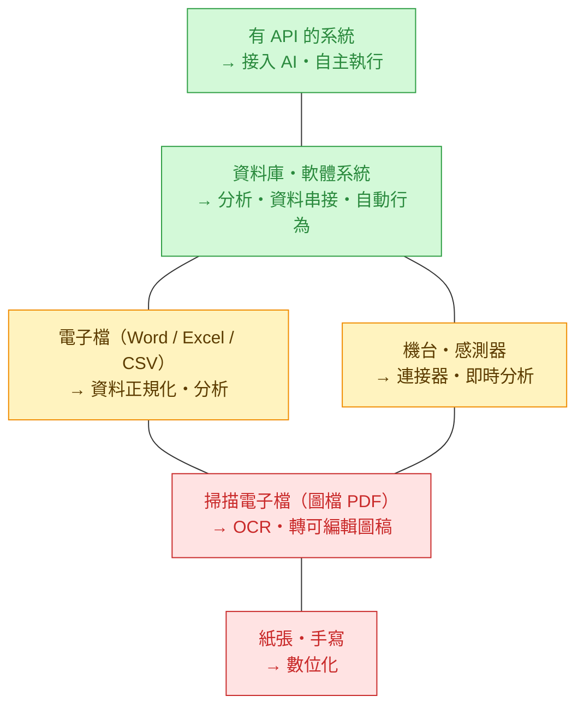

# 資料數位化程度與 AI 介入

> 一句話:你的資料**數位化到哪一級**,決定 AI 能**介入到多深** —— 從「先幫你把它變成資料」,一路到「AI 直接接進來、自動做事」。
>
> **它在系列裡的位置**:站在主線最前面的**輸入側**,和《[資料防護](雲端AI資料防護構想.md)》並排——一個問「**接不接得到**(能用)」、一個問「**准不准用**(該上雲)」;兩關都過,才進《[職務框架](AI職務增強評估框架.md)》看誰增效。

---

## 一、資料準備度階梯（低 → 高）

> 越往上,資料越「能被程式直接拿來用」;AI 的角色也從**幫你把資料生出來** → 變成**直接接進來行動**。

🟥 要先數位化　🟨 可用但需整理 / 接線　🟩 AI 幾乎即插即用

---

## 二、每一級：資料長相 × AI 在這級做什麼

> 由低到高;**電子檔**與**機台・感測器**屬**同一級**(只是不同型態,沒有上下之分)。

| 資料來源 | 數位化程度 | AI 介入 / 協助 | 白話 |
|---|---|---|---|
| **紙張、手寫** | 類比(最低) | 數位化 | 先把紙變成檔——拍照 / 掃描 / 輸入 |
| **掃描電子檔**(圖檔 PDF) | 是檔,但機器讀不懂 | 數位化(OCR)、轉圖稿 | OCR 把圖裡的字認出來、轉成可編輯 |
| **電子檔**(Word / Excel / CSV) | 可讀,但散亂 | 資料正規化、資料分析 | 把雜亂欄位整理乾淨、開始做分析 |
| **機台、感測器** | 有訊號,要接 | 連接器、資料分析 | 做連接器把訊號收進來、即時分析 |
| **資料庫、軟體系統** | 已結構化 | 資料分析、資料串接、自動行為 | 跨系統串資料、分析、觸發自動動作 |
| **有 API 的系統** | 可程式存取(最高) | 接入 AI | AI 直接接上去讀寫、自主執行 |

---

## 三、實例：同一份「設備點檢紀錄」走過各級

| 它在哪一級 | 這份紀錄長什麼樣 | AI 在這級幫的 |
|---|---|---|
| 紙張・手寫 | 師傅在點檢表上手寫「3 號機 軸承溫度偏高」 | 拍照 / 掃描,先變成檔 |
| 掃描電子檔 | 點檢表掃成 PDF(還是一張圖) | OCR 把字認出來、轉成文字 |
| 電子檔 | 改用 Excel 一欄一欄填 | 整理欄位、統計異常次數 |
| 機台・感測器 | 機台自動把溫度、振動寫進 log | 做連接器收訊號、即時看趨勢 |
| 資料庫・軟體系統 | 紀錄進 MES / ERP,可查詢、可關聯 | 跨機台分析、串維修工單 |
| 有 API 的系統 | 系統開 API | AI 直接讀、預測故障、自動開工單 |

> 同一件事,從「手寫在紙上」到「AI 自動開工單」——差別只在它被放在哪一級。

---

## 四、重點：數位化 ≠ AI 用得了

> 別被「我們都電子化了」騙了——對 AI 來說有**兩道門**:
> 1. **機器讀得懂嗎?** 掃描的 PDF 是「圖」,要 OCR 才變成「字」。
> 2. **程式接得到嗎?** Excel 要人開檔貼上;API 是程式直接抓。
>
> 過了這兩道門,資料才真的「能用」。所以這把尺量的不是「**有沒有電子檔**」,而是「**離 AI 能直接用還差幾步**」。

> ⚠️ **這跟《職務框架》是不同的尺**:職務那兩把量的是「**人**(工具關係)」與「**工作成果**(產出物)」;這把量的是「**資料本身接不接得到**」。三條長得像,但量的不是同一件事——一個「製作工具高手」面對一疊**手寫紙**,照樣卡住。

---

## 五、資料的另一條問題：能用 × 准用（2×2）

前面整條尺講的是「**能不能用**(AI 接不接得到)」。但同一份資料還有**另一個獨立問題**:「**准不准用**(會不會外洩、該不該上雲)」——那是《[資料防護](雲端AI資料防護構想.md)》那把尺。兩者**互不取代**,交叉成一張**輸入端篩選表**:

| ＼ | 可用度低（紙本 / 掃描圖） | 可用度高（資料庫 / API） |
|---|---|---|
| **敏感度高**（最機密） | 🔴 **最後碰**:手寫病歷、紙本合約 → 暫緩 / 私有部署 | 🟡 **接但遮罩**:CRM 客戶個資、薪資 → 走《資料防護》閘道去識別化 |
| **敏感度低**（可上雲） | 🟢 **放心先數位化**:倉庫紙本、舊掃描型錄 → 先 OCR,風險小 | 🟢 **綠燈先做**:機台點檢 log、公開型錄、ERP 出貨量 → 直接接 |

> 這是**輸入端**篩選(資料進不進得了場);跟《職務框架》那張 3×3 是**輸出端**(哪個職務增效)——**兩階段、別疊成立體**:先過這張,再進那張。

---

## 六、怎麼用

- **先盤點**:同一家公司常常六級都有(倉庫紙本、掃描舊檔、Excel、產線感測器、ERP、雲端 SaaS)——把你的主要資料各標在哪一級。
- **第一步常常是「往上推一級」**:紙 → OCR → 正規化……因為**越上面,AI 越好接、越能自動化**。低級資料不是不能用,而是 AI 要先花力氣把它「變成資料」。
- **越上面越快見效**:有 API 的系統幾乎即插即用;紙本要先投入數位化才談得上分析。挑導入順序時,**資料已在高級的地方先做**(對應職務框架「先打甜蜜點」的概念)。
- **別忘了防護**:越好接的資料越要注意分級與權限——接得越深,外洩風險的面也越大(見《資料防護構想》)。

**白話盤點(每筆主要資料問 4 題):**
1. 是不是**紙本 / 圖檔**?(要先數位化 / OCR)
2. **程式接不接得到**?(要不要人工開檔)
3. 裡面有沒有**個資 / 財報 / 原始碼**?(敏感)
4. 能不能**去識別化**後再用?

→ 第 1、2 題決定「**能不能用**」;第 3、4 題決定「**准不准用**」。**兩邊都綠燈的就是第一批**。

**兩步走(以設備點檢為例):** 若某職務落在職務框架甜蜜點、卻發現點檢還停在**手寫紙本** → 第一步**先把資料推一級**(拍照 / OCR / 填 Excel 或 MES),第二步**才套職務框架**判斷增效。資料沒到位前,職務紅利「看得到吃不到」。

---

> **系列**:[總覽](00-AI導入總覽.md)｜① [資料防護](雲端AI資料防護構想.md)｜② [職務框架](AI職務增強評估框架.md)｜③ [價值飛輪](AI增效價值飛輪與分配.md)｜🔧 [Claude 落地](Claude落地實作示例.md)｜**📊 資料數位化（本篇）**
