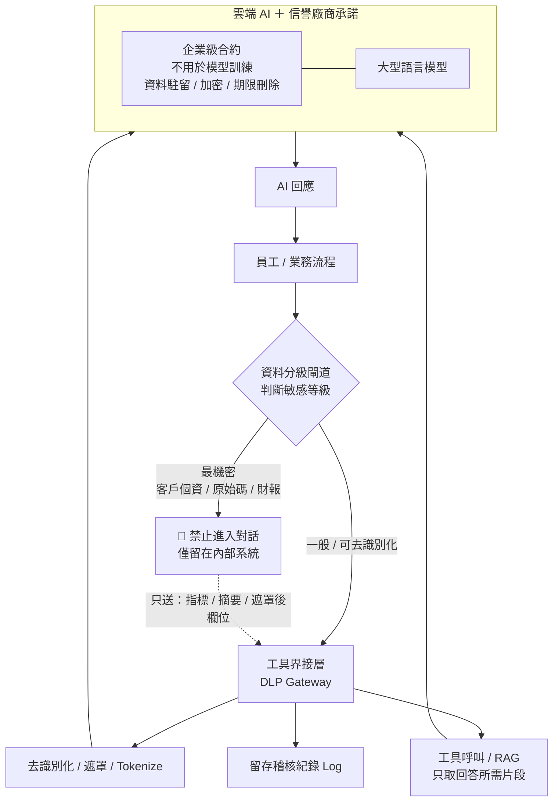
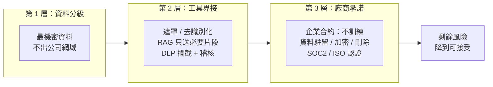

# 雲端 AI 資料防護構想

## 一、問題：成本 vs. 能力 vs. 外洩風險的三難

| 選項 | 能力 | 成本 | 資料風險 |
|------|------|------|----------|
| 雲端 AI | ⭐⭐⭐ 強 | 💲 低 | ⚠️ 怕外洩 |
| 自建 AI | ⭐⭐ 中 | 💲💲💲 高 | ✅ 可控 |
| 低階/便宜 AI | ⭐ 弱 | 💲 低 | ✅ 可控 |

> **核心構想**：選用「雲端 AI」，但在資料離開公司前加一層**閘道**——
> 透過**工具界接**控制上傳/對話內容、靠**信譽廠商承諾**做合約保障、
> 並用**資料分級**確保「最機密資料」根本不進入對話，把外洩風險壓到可接受範圍。

---

## 二、資料流與防護閘道（主架構）

---

## 三、三層縱深防禦（為什麼風險可被壓低）

| 防線 | 手段 | 擋住什麼 |
|------|------|----------|
| 資料分級 | 事前界定「最機密」清單，源頭阻擋 | 最嚴重的整批外洩 |
| 工具界接 | 遮罩、Tokenize、RAG 片段化、DLP、稽核 | 不慎貼上的敏感欄位 |
| 廠商承諾 | 企業合約、不訓練、資料駐留、第三方認證 | 廠商端二次利用 / 留存 |

---

## 四、誠實的提醒（剩餘風險）

此構想能**大幅降低**風險，但無法做到 0：

- **分級準確度是命門**：若「最機密」清單界定不全，閘道就攔不到——需定期檢視。
- **工具界接會有漏網**：自由文字對話仍可能夾帶敏感資訊，DLP 規則需持續調校。
- **承諾 ≠ 技術隔離**：合約是「事後究責」，不等於「事前無法存取」；高度敏感場景仍建議評估
  廠商的私有部署 / VPC 方案。
- **建議搭配**：權限最小化、對話保留期限、員工教育訓練、抽樣稽核。

> 結論：以「**雲端能力 + 三層防護**」取代「全自建」，是**成本與安全的務實折衷**——
> 適合多數一般與內部資料；真正不能外流的那一小撮「最機密」，靠分級從源頭擋下。
